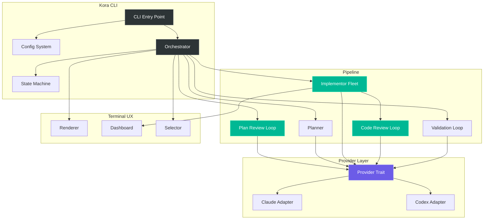

<p align="center">
  
</p>

<h1 align="center">Kora</h1>

<p align="center">
  <strong>Multi-agent development orchestration CLI</strong><br>
  One command to research, plan, implement, review, and validate code changes.
</p>

<p align="center">
  <a href="#install"></a>
  <a href="LICENSE"></a>
  
  
</p>

---

## Why Kora?

AI coding agents are powerful individually — but they make mistakes. They skip edge cases, introduce security issues, forget about backward compatibility, and write code that drifts from the original intent.

**What if an AI agent had the same safety net that human developers have?** A team. A code reviewer who catches bugs. A security auditor who spots vulnerabilities. A senior engineer who filters out noise. A QA lead who verifies the result matches the plan.

Kora is that team. Instead of one agent doing everything and hoping for the best, Kora orchestrates **specialized agents** — each with a clear role, each checking the others' work. The researcher explores and plans. The reviewers challenge the plan. The judge filters real issues from nitpicks. The implementors write code in parallel. The code reviewers audit every diff. The validator confirms the result matches the intent.

The result: code changes that are researched, planned, reviewed, implemented, audited, and validated — not just generated.

### What does "Kora" mean?

The [kora](https://en.wikipedia.org/wiki/Kora_(instrument)) is a West African string instrument with 21 strings, each playing its own voice. A single musician plays all strings simultaneously, weaving them into one cohesive piece. Like the instrument, Kora the tool orchestrates many independent agents — each with its own purpose — into a single, harmonious output.

---

## How it works

```mermaid
graph LR
    A[You] -->|describe| B(Researcher)
    B -->|plan| C(Plan Reviewer)
    B -->|plan| D(Plan Security Auditor)
    C -->|findings| E(Judge)
    D -->|findings| E
    E -->|revise| B
    E -->|approve| F(Planner)
    F -->|tasks| G(Test Architect)
    G -->|specs| H(Implementors)
    H -->|code| I(Code Reviewer)
    H -->|code| K(Code Security Auditor)
    I -->|findings| M(Code Judge)
    K -->|findings| M
    M -->|valid| H
    M -->|approve| J(Validator)
    J -->|done| L[Your branches]

    style A fill:#1a1a2e,stroke:#e94560,color:#fff
    style B fill:#16213e,stroke:#0f3460,color:#fff
    style C fill:#16213e,stroke:#0f3460,color:#fff
    style D fill:#16213e,stroke:#0f3460,color:#fff
    style E fill:#16213e,stroke:#0f3460,color:#fff
    style F fill:#16213e,stroke:#0f3460,color:#fff
    style G fill:#16213e,stroke:#0f3460,color:#fff
    style H fill:#16213e,stroke:#0f3460,color:#fff
    style I fill:#16213e,stroke:#0f3460,color:#fff
    style J fill:#16213e,stroke:#0f3460,color:#fff
    style K fill:#16213e,stroke:#0f3460,color:#fff
    style L fill:#1a1a2e,stroke:#e94560,color:#fff
    style M fill:#16213e,stroke:#0f3460,color:#fff
```

```
$ kora

  kora v0.1.0 · claude (default) · 2 checkpoints configured

  ready. describe what you'd like to build, fix, or change.

> add dark mode support that respects system preferences
```

You describe what you want. Kora handles the rest:



**Specialized agents, one pipeline:**

| Agent | Role |
|-------|------|
| **Researcher** | Explores your codebase, clarifies requirements with you, proposes a detailed plan |
| **Plan Reviewer** | Challenges the plan — finds missing edge cases, backward compatibility issues, architectural concerns |
| **Plan Security Auditor** | Reviews the plan for security implications before any code is written |
| **Judge** | Filters nitpicks from real issues. Only high-value findings go back for revision |
| **Planner** | Breaks the approved plan into parallel tasks with a dependency graph |
| **Test Architect** | Designs the test strategy before implementation — what to test, what edge cases to cover |
| **Implementors** | A fleet of agents executing tasks simultaneously in isolated git worktrees |
| **Code Reviewer** | Reviews every code diff for bugs, logic errors, and quality issues |
| **Code Security Auditor** | Reviews every code diff for security vulnerabilities |
| **Validator** | Verifies the implementation matches the plan, runs tests, detects drift |

## Key features

- **Provider-agnostic** — uses your existing AI CLI tools (Claude Code, Codex, or Gemini). No API keys, no vendor lock-in
- **Parallel execution** — implementors work simultaneously in isolated git worktrees. A 4-task feature gets 4 agents working at once
- **Two quality loops** — the plan is reviewed before code is written, then every code diff is reviewed after. Both loops use a judge to filter noise from real issues
- **Resumable** — every stage transition is saved to disk. Ctrl+C and `kora resume` later. Nothing is lost
- **You stay in control** — configurable checkpoints let you approve at any stage. Remote operations (push, PRs) always require explicit approval
- **Three verbosity modes** — press `Tab` to toggle between focused (just verdicts), detailed (findings + summaries), and verbose (full agent output)

## What a run looks like

```
  researcher ·········································· analyzing ●

  Found 47 files relevant to your request.
  Proposing approach with 3 key changes...

  ? Approve this direction? (approve / adjust)

> approve

                                                     iteration 1 of 3
━━━━━━━━━━━━━━━━━━━━━━━━━━━━━━━━━━━━━━━━━━━━━━━━━━━━━━━━━━━━━━━━━━━━━━━

  reviewer ·········································· analyzing plan ●

    ▲ HIGH   No database migration strategy
    ■ MED    Missing error boundary for lazy-loaded assets
    · LOW    Could use const enum — dismissed

  judge ·············································· evaluating ●

    ▲ DB migration          accepted
    ■ Error boundary        accepted
    · Const enum            dismissed

  researcher ········································ revising ●

    ✓ Added migration strategy
    ✓ Added ErrorBoundary wrapper

  ✓ plan approved                              2 iterations · 47s

━━━━━━━━━━━━━━━━━━━━━━━━━━━━━━━━━━━━━━━━━━━━━━━━━━━━━━━━━━━━━━━━━━━━━━━

  implementing ······································ 2 of 4 ●

    T1  claude  ████████████  ✓ 34s     feat/theme-context    7 files
    T2  codex   ████████████  ✓ 12s     feat/css-variables    3 files
    T3  claude  ██████████░░  running   feat/migration
    T4  claude  ███░░░░░░░░░  running   feat/integration

━━━━━━━━━━━━━━━━━━━━━━━━━━━━━━━━━━━━━━━━━━━━━━━━━━━━━━━━━━━━━━━━━━━━━━━

  code review ······································ T1 ●

      ▲ HIGH   SQL injection in query builder
      · LOW    Variable naming — dismissed

    implementor ···································· fixing T1 ●
      ✓ Fixed SQL injection

  code review ······································ T1 iteration 2 ●
      ✓ all findings dismissed

━━━━━━━━━━━━━━━━━━━━━━━━━━━━━━━━━━━━━━━━━━━━━━━━━━━━━━━━━━━━━━━━━━━━━━━

  ✓ implementation complete                     4 tasks · 1m 23s

  ? What would you like to do with the changes?

    ❯ Merge all into current branch
      Create a single combined branch
      Leave branches as-is

  ✓ merged 4 branches

  ? Push to remote?

    ❯ Done — keep changes local
      Push branch to remote
      Push and create a Pull Request
```

## Install

Requires at least one AI CLI tool installed: [Claude Code](https://docs.anthropic.com/en/docs/claude-code), [Codex](https://github.com/openai/codex), or Gemini.

```bash
# npm
npm install -g @usekora/kora

# Homebrew (coming soon)
# brew install usekora/tap/kora

# Cargo
cargo install kora

# Direct download
curl -fsSL https://raw.githubusercontent.com/usekora/kora/main/install.sh | sh
```

## Quick start

```bash
# 1. Configure (first time only)
kora configure

# 2. Start an interactive session
kora

# 3. Or run a one-shot command
kora run "add rate limiting to the /api/users endpoint"
```

## Usage

### Interactive session

```bash
kora
```

Drop into a conversational session. Describe what you want, watch agents work, approve at checkpoints. The session stays alive — run multiple tasks without restarting.

**Inline commands during a session:**

| Command | Action |
|---------|--------|
| `/status` | Current run progress |
| `/verbose` | Toggle verbosity mode |
| `/config` | Show config |
| `/help` | List commands |
| `/quit` | Exit session |

### One-shot mode

```bash
kora run "fix the N+1 query in the deployments endpoint"
```

| Flag | Effect |
|------|--------|
| `--yolo` | No checkpoints, full autopilot |
| `--careful` | Checkpoint at every stage |
| `--dry-run` | Research + review only, no implementation |
| `-p claude` | Override provider for this run |

### Other commands

```bash
kora configure    # Interactive setup wizard
kora resume       # Resume an interrupted session
kora history      # View past runs
kora clean        # Clean up old run data
```

## Configuration

```bash
kora configure
```

Interactive wizard that creates `~/.kora/config.yml` (personal) or `.kora/config.yml` (shared with team). When both exist, personal config takes precedence — like Claude Code's settings model.

```yaml
version: 1
default_provider: claude

agents:
  researcher:
    provider: default
    custom_instructions: .kora/prompts/researcher-extra.md  # optional

checkpoints:
  - after_researcher
  - after_planner

review_loop:
  max_iterations: 3

implementation:
  branch_strategy: separate
  parallel_limit: 4

output:
  default_verbosity: focused
```

**Custom instructions** — extend any agent's behavior without replacing the base prompt:

```yaml
agents:
  researcher:
    custom_instructions: .kora/prompts/researcher-extra.md
```

The file contents are appended to the built-in prompt. Base prompts are baked into the binary and cannot be replaced — only extended.

## Architecture



**Key design decisions:**

- **Agents are stateless** — they communicate through files, not memory. The orchestrator mediates everything. A Claude researcher can hand off to a Codex reviewer seamlessly because the handoff is a file, not a conversation thread.
- **CLI-only provider integration** — Kora spawns `claude`, `codex`, or `gemini` as subprocesses. No API keys, no SDKs, no token management. Your CLI tools handle authentication.
- **Everything is resumable** — state is persisted to `~/.kora/runs/` after every stage transition. Process dies? `kora resume` picks up exactly where it left off.
- **Remote operations require consent** — Kora never pushes code or creates PRs without explicit approval. Even in `--yolo` mode, remote operations are interactive.

## Contributing

```bash
git clone https://github.com/usekora/kora.git
cd kora
cargo build
cargo test
```

## License

MIT
