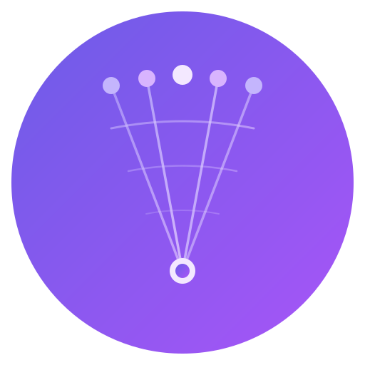
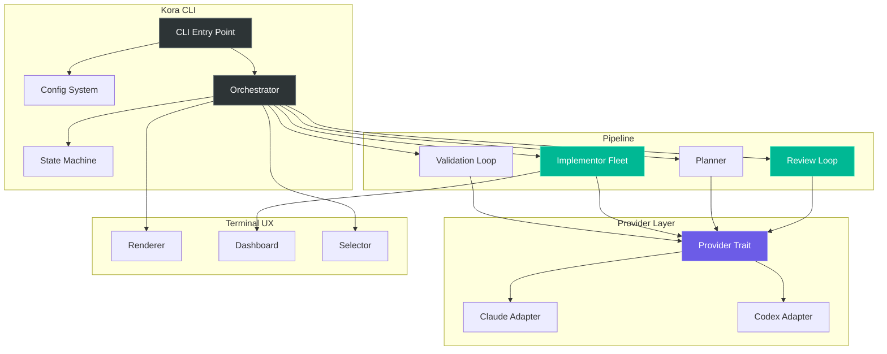

<p align="center">
  
</p>

<h1 align="center">Kora</h1>

<p align="center">
  <strong>Multi-agent development orchestration CLI</strong><br>
  One command to research, plan, implement, review, and validate code changes.
</p>

<p align="center">
  <a href="#install"></a>
  <a href="LICENSE"></a>
  
  
</p>

---

Kora orchestrates a team of AI coding agents through a structured pipeline to implement features, fix bugs, and refactor code. You describe what you want — Kora researches, plans, reviews, implements, and validates.

```
$ kora

  kora v0.1.0 · claude (default) · 2 checkpoints configured

  ready. describe what you'd like to build, fix, or change.

> add dark mode support that respects system preferences
```

## How it works

```mermaid
graph LR
    A[You] -->|describe| B(Researcher)
    B -->|plan| C(Plan Reviewer)
    B -->|plan| D(Plan Security Auditor)
    C -->|findings| E(Judge)
    D -->|findings| E
    E -->|revise| B
    E -->|approve| F(Planner)
    F -->|tasks| G(Test Architect)
    G -->|specs| H(Implementors)
    H -->|code| I(Code Reviewer)
    H -->|code| K(Code Security Auditor)
    I -->|findings| M(Code Judge)
    K -->|findings| M
    M -->|valid| H
    M -->|approve| J(Validator)
    J -->|done| L[Your branches]

    style A fill:#1a1a2e,stroke:#e94560,color:#fff
    style B fill:#16213e,stroke:#0f3460,color:#fff
    style C fill:#16213e,stroke:#0f3460,color:#fff
    style D fill:#16213e,stroke:#0f3460,color:#fff
    style E fill:#16213e,stroke:#0f3460,color:#fff
    style F fill:#16213e,stroke:#0f3460,color:#fff
    style G fill:#16213e,stroke:#0f3460,color:#fff
    style H fill:#16213e,stroke:#0f3460,color:#fff
    style I fill:#16213e,stroke:#0f3460,color:#fff
    style J fill:#16213e,stroke:#0f3460,color:#fff
    style K fill:#16213e,stroke:#0f3460,color:#fff
    style L fill:#1a1a2e,stroke:#e94560,color:#fff
    style M fill:#16213e,stroke:#0f3460,color:#fff
```



**Specialized agents, one pipeline:**

| Agent | Role |
|-------|------|
| **Researcher** | Explores codebase, clarifies requirements, proposes plan |
| **Plan Reviewer** | Finds bugs, missing edge cases, architectural issues in the plan |
| **Plan Security Auditor** | Reviews plan for security implications |
| **Judge** | Filters nitpicks from real issues, decides what to fix |
| **Planner** | Breaks plan into parallel tasks with dependency graph |
| **Test Architect** | Designs test strategy before code is written |
| **Implementors** | Fleet of agents executing tasks in parallel git worktrees |
| **Code Reviewer** | Reviews actual code diffs for bugs and quality |
| **Code Security Auditor** | Reviews actual code diffs for security vulnerabilities |
| **Validator** | Checks implementation matches plan, runs tests, detects drift |

## Key features

- **Provider-agnostic** — uses Claude, Codex, or Gemini CLI tools. No API keys needed.
- **Parallel execution** — implementors work simultaneously in isolated git worktrees
- **Quality loops** — reviewer + security auditor + judge iterate on both the plan and the code until issues are resolved
- **Resumable** — all state saved to disk. `kora resume` picks up where you left off
- **Configurable checkpoints** — approve at every stage, or `--yolo` for full autopilot
- **Three verbosity modes** — press `Tab` to toggle between focused, detailed, and verbose
- **Push & PR when you're ready** — optionally push branches and create pull requests after review. Always requires explicit approval, never automatic

## Install

Requires at least one AI CLI tool installed: [Claude Code](https://docs.anthropic.com/en/docs/claude-code), [Codex](https://github.com/openai/codex), or Gemini.

```bash
# npm
npm install -g @usekora/kora

# Homebrew (coming soon)
# brew install usekora/tap/kora

# Cargo
cargo install kora

# Direct download
curl -fsSL https://raw.githubusercontent.com/usekora/kora/main/install.sh | sh
```

## Quick start

```bash
# 1. Configure (first time only)
kora configure

# 2. Start an interactive session
kora

# 3. Or run a one-shot command
kora run "add rate limiting to the /api/users endpoint"
```

## Usage

### Interactive session

```bash
kora
```

Drop into a conversational session. Describe what you want, watch agents work, approve at checkpoints. The session stays alive — run multiple tasks without restarting.

**Inline commands during a session:**

| Command | Action |
|---------|--------|
| `/status` | Current run progress |
| `/verbose` | Toggle verbosity mode |
| `/config` | Show config |
| `/help` | List commands |
| `/quit` | Exit session |

### One-shot mode

```bash
kora run "fix the N+1 query in the deployments endpoint"
```

**Flags:**

| Flag | Effect |
|------|--------|
| `--yolo` | No checkpoints, full autopilot |
| `--careful` | Checkpoint at every stage |
| `--dry-run` | Research + review only, no implementation |
| `-p claude` | Override provider for this run |

### Other commands

```bash
kora configure    # Interactive setup wizard
kora resume       # Resume an interrupted session
kora history      # View past runs
kora clean        # Clean up old run data
```

## What a run looks like

```
  researcher ·········································· analyzing ●

  Found 47 files relevant to your request.
  Proposing approach with 3 key changes...

  ? Approve this direction? (approve / adjust)

> approve

                                                     iteration 1 of 3
━━━━━━━━━━━━━━━━━━━━━━━━━━━━━━━━━━━━━━━━━━━━━━━━━━━━━━━━━━━━━━━━━━━━━━━

  reviewer ·········································· analyzing plan ●

    ▲ HIGH   No database migration strategy
    ■ MED    Missing error boundary for lazy-loaded assets
    · LOW    Could use const enum — dismissed

  judge ·············································· evaluating ●

    ▲ DB migration          accepted
    ■ Error boundary        accepted
    · Const enum            dismissed

  researcher ········································ revising ●

    ✓ Added migration strategy
    ✓ Added ErrorBoundary wrapper

  ✓ plan approved                              2 iterations · 47s

━━━━━━━━━━━━━━━━━━━━━━━━━━━━━━━━━━━━━━━━━━━━━━━━━━━━━━━━━━━━━━━━━━━━━━━

  implementing ······································ 2 of 4 ●

    T1  claude  ████████████  ✓ 34s     feat/theme-context    7 files
    T2  codex   ████████████  ✓ 12s     feat/css-variables    3 files
    T3  claude  ██████████░░  running   feat/migration
    T4  claude  ███░░░░░░░░░  running   feat/integration

━━━━━━━━━━━━━━━━━━━━━━━━━━━━━━━━━━━━━━━━━━━━━━━━━━━━━━━━━━━━━━━━━━━━━━━

  code review ······································ T1 ●

    code reviewer ·································· analyzing diff ●
    code security auditor ·························· analyzing diff ●

      ▲ HIGH   SQL injection in query builder
      · LOW    Could use more descriptive variable name — dismissed

    code judge ····································· evaluating ●

      ▲ SQL injection             accepted
      · Variable name             dismissed

    implementor ···································· fixing T1 ●

      ✓ Fixed SQL injection in query builder

  code review ······································ T1 iteration 2 ●

    code reviewer ·································· analyzing diff ●
    code security auditor ·························· analyzing diff ●
    code judge ····································· evaluating ●

      ✓ all findings dismissed

━━━━━━━━━━━━━━━━━━━━━━━━━━━━━━━━━━━━━━━━━━━━━━━━━━━━━━━━━━━━━━━━━━━━━━━

  ✓ implementation complete                     4 tasks · 1m 23s

  ? What would you like to do with the changes?

    ❯ Merge all into current branch
      Create a single combined branch
      Leave branches as-is

  ✓ merged 4 branches

  ? Push to remote?

    ❯ Done — keep changes local
      Push branch to remote
      Push and create a Pull Request
```

## Configuration

```bash
kora configure
```

Interactive wizard that creates `.kora/config.yml`:

```yaml
version: 1
default_provider: claude

agents:
  researcher:
    provider: default
    custom_instructions: .kora/prompts/researcher-extra.md  # optional
  reviewer:
    provider: default
  # ...

checkpoints:
  - after_researcher
  - after_planner

review_loop:
  max_iterations: 3

implementation:
  branch_strategy: separate
  parallel_limit: 4

output:
  default_verbosity: focused
```

**Custom instructions** — extend any agent's behavior without replacing the base prompt:

```yaml
agents:
  researcher:
    custom_instructions: .kora/prompts/researcher-extra.md
```

The file contents are appended to the built-in prompt. The base prompts are baked into the binary and cannot be replaced.

## Architecture



All state is persisted to `.kora/runs/` as plain JSON/YAML files. If the process dies, `kora resume` picks up exactly where it left off.

## How agents communicate

Agents are stateless. They don't talk to each other — the orchestrator passes files between them:

```
Researcher writes plan → Orchestrator injects into Reviewer prompt
Reviewer writes findings → Orchestrator injects into Judge prompt
Judge approves → Orchestrator injects plan into Planner prompt
Planner writes tasks → Orchestrator injects into each Implementor prompt
Implementor writes code → Code Reviewer + Code Security Auditor review the diff
Code findings → Judge evaluates → valid issues sent back to Implementor for fixes
```

A Claude researcher can hand off to a Codex reviewer seamlessly because the handoff is a file, not a conversation.

## Contributing

```bash
git clone https://github.com/usekora/kora.git
cd kora
cargo build
cargo test
```

## License

MIT
